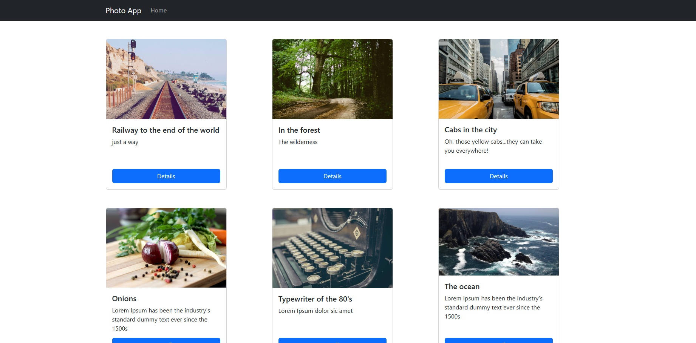

# React Photo App


An application where users can add, delete or mark as done different daily tasks. This project was bootstrapped with [Create React App](https://github.com/facebook/create-react-app).

## Table of Contents

- [Installation](#get_started)
- [Technology](#technology)
- [Author](#author)
- [Future Functionalities](#future_functionalities)
- [Support](#support)

## Screenshot




## Live version

For the live version of this project please visit the following [link]()

## Get_started

```bash
    git clone git@github.com:Mesi14/react-photo-app
    cd into the folder by typing: cd react-photo-app
    install dependencies with npm install
    start the server with $npm run start-server
    start the app with $npm start
```

## Technology

- React
- Local Storage
- JavaScript ES6
- json server
- HTML
- CSS

## Author :bust_in_silhouette:

- [Mesi](https://github.com/Mesi14)

## Future_Functionalities:

- back-end with DB

## Support

Give a :star: if you liked the page


## 🙏 Acknowledgments 

I would like to thank everyone who reviewed this project.


## 📝 License

This project is [MIT](license.txt) licensed.
